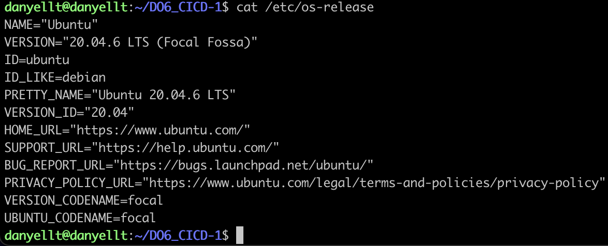
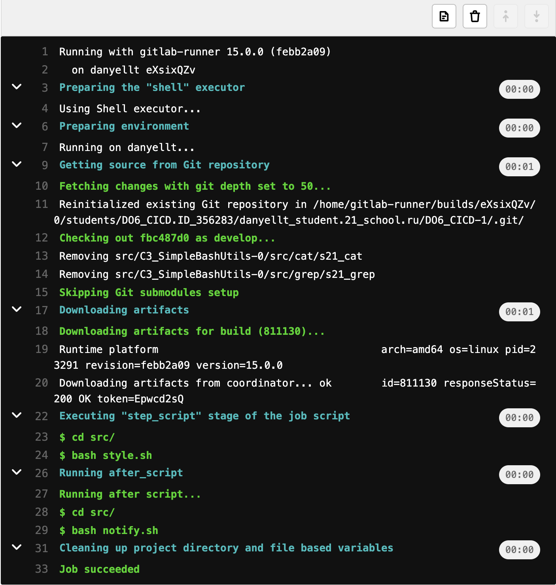

# Part 1. Настройка gitlab-runner

Поднять виртуальную машину Ubuntu Server 20.04 LTS



Скачать и установить на виртуальную машину gitlab-runner


Запустить gitlab-runner и зарегистрировать его для использования в текущем проекте (DO6_CICD)


# Part 2. Сборка

Написать этап для CI по сборке приложений из проекта C2_SimpleBashUtils:

В файле gitlab-ci.yml добавить этап запуска сборки через мейк файл из проекта C2


Файлы, полученные после сборки (артефакты), сохранять в произвольную директорию со сроком хранения 30 дней.

Скрипт сборки:


Этап сборки:


Результат:


# Part 3. Тест кодстайла

Написать этап для CI, который запускает скрипт кодстайла (clang-format):
Если кодстайл не прошел, то "зафейлить" пайплайн
В пайплайне отобразить вывод утилиты clang-format

Скрипт проверки:


Этап проверки стиля:


Успешный результат:



Неуспешный результат:


# Part 4. Интеграционные тесты

Написать этап для CI, который запускает ваши интеграционные тесты из того же проекта:
Запускать этот этап автоматически только при условии, если сборка и тест кодстайла прошли успешно
Если тесты не прошли, то "зафейлить" пайплайн
В пайплайне отобразить вывод, что интеграционные тесты успешно прошли / провалились

Скрипт тестов:


Этап тестов:


Успешный результат:


Неуспешный результат:


# Part 5. Этап деплоя

Поднять вторую виртуальную машину Ubuntu Server 20.04 LTS


Написать этап для CD, который "разворачивает" проект на другой виртуальной машине:
Запускать этот этап вручную при условии, что все предыдущие этапы прошли успешно


Написать bash-скрипт, который при помощи ssh и scp копирует файлы, полученные после сборки (артефакты), в директорию /usr/local/bin второй виртуальной машины


Добавим вторую машину в одну сеть с первой машиной


Создадим ssh ключ на машине с gitlab-runner командой ```ssh-keygen -t rsa``` и скопируем его на вторую машину командой ```ssh-copy-id danyellt@172.24.116.8```.

Поменяем привилегии на второй машине для директории /usr/local/bin для беспарольного копирования файлов командой ```sudo chown danyellt /usr/local/bin```

Успешный результат:


Неуспешный результат:


# Part 6. Дополнительно. Уведомления

Настроить уведомления о успешном/неуспешном выполнении пайплайна через бота с именем "[ваш nickname] DO6 CI/CD" в Telegram

Текст уведомления должен содержать информацию об успешности прохождения как этапа CI, так и этапа CD.
В остальном текст уведомления может быть произвольным.

Создание бота:


Скрипт оповещения:


Этапы:


Результат:

